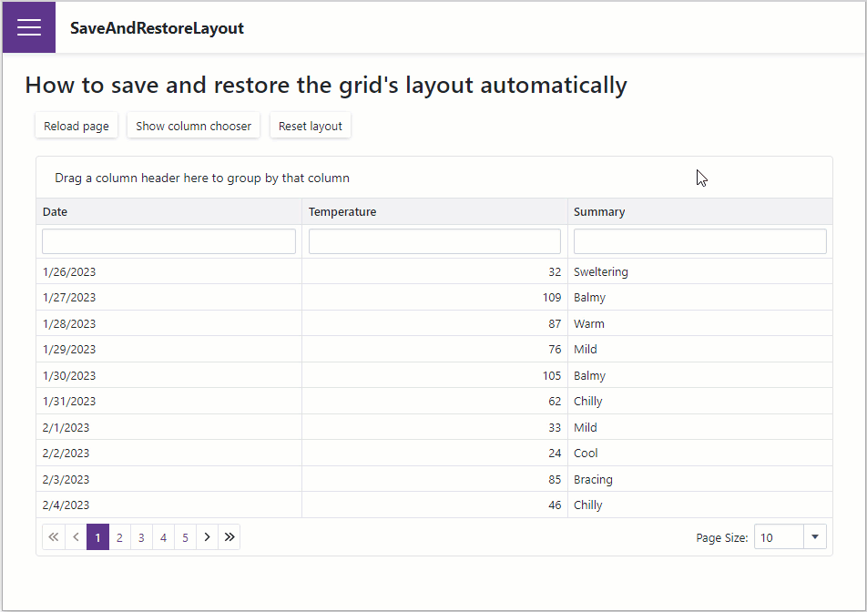
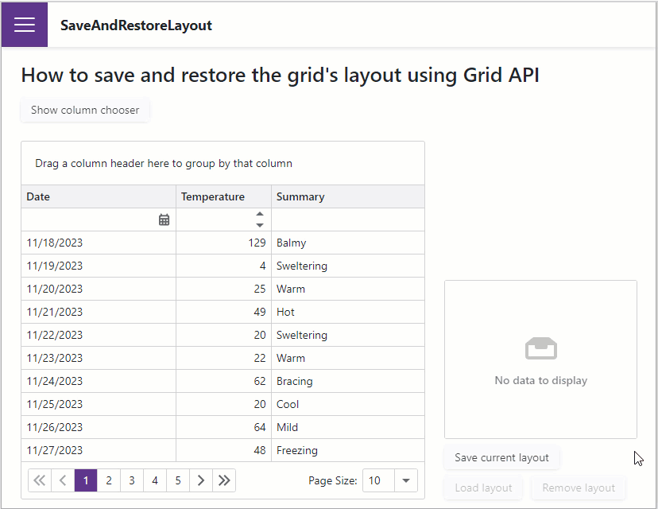

<!-- default badges list -->

<!-- default badges end -->

# Grid for Blazor - Save and load layout information

The DevExpress Blazor [Grid](https://docs.devexpress.com/Blazor/403143/grid) allows you to save layout information between application sessions. This example demonstrates two different approaches to how to save and restore a grid layout:

* Handle the Grid's [LayoutAutoSaving](https://docs.devexpress.com/Blazor/DevExpress.Blazor.DxGrid.LayoutAutoSaving) and [LayoutAutoLoading](https://docs.devexpress.com/Blazor/DevExpress.Blazor.DxGrid.LayoutAutoLoading) events to automatically save and restore the grid layout. On the [Auto.razor](./CS/SaveAndRestoreLayout/SaveAndRestoreLayout/Pages/Auto.razor) page, the Grid saves the current layout information to the [local storage](https://developer.mozilla.org/en-US/docs/Web/API/Window/localStorage) once the layout changes. When the page reloads, the Grid restores the saved layout.

    

* Call the Grid's [SaveLayout](https://docs.devexpress.com/Blazor/DevExpress.Blazor.DxGrid.SaveLayout) and [LoadLayout](https://docs.devexpress.com/Blazor/DevExpress.Blazor.DxGrid.LoadLayout(DevExpress.Blazor.GridPersistentLayout)) methods to save and restore the grid layout on demand. On the [API.razor](./CS/SaveAndRestoreLayout/SaveAndRestoreLayout/Pages/API.razor) page, the Grid saves the current layout information after a user clicks the **Save current layout** button. A List Box to the right of the Grid displays all saved layout items. When a user selects an item in the List Box and clicks the **Load layout** button, the Grid restores the selected layout.

    

## Files to Review

- [Auto.razor](./CS/SaveAndRestoreLayout/SaveAndRestoreLayout/Pages/Auto.razor)
- [API.razor](./CS/SaveAndRestoreLayout/SaveAndRestoreLayout/Pages/API.razor)

## Documentation

* [GridPersistentLayout](https://docs.devexpress.com/Blazor/DevExpress.Blazor.DxGrid.LoadLayout(DevExpress.Blazor.GridPersistentLayout))
* [LayoutAutoSaving](https://docs.devexpress.com/Blazor/DevExpress.Blazor.DxGrid.LayoutAutoSaving)
* [LayoutAutoLoading](https://docs.devexpress.com/Blazor/DevExpress.Blazor.DxGrid.LayoutAutoLoading)
* [SaveLayout](https://docs.devexpress.com/Blazor/DevExpress.Blazor.DxGrid.SaveLayout)
* [LoadLayout](https://docs.devexpress.com/Blazor/DevExpress.Blazor.DxGrid.LoadLayout(DevExpress.Blazor.GridPersistentLayout))
