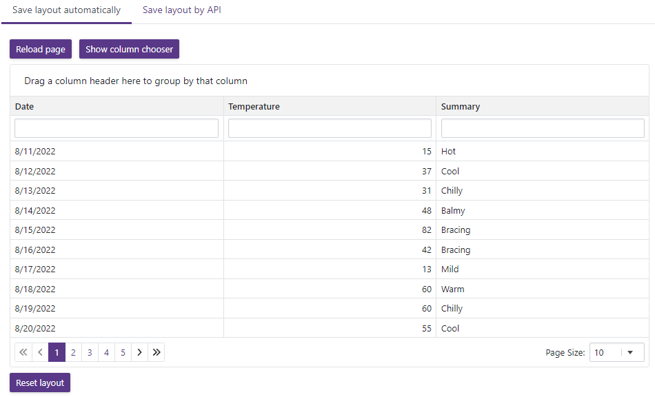

<!-- default badges list -->

<!-- default badges end -->
<!-- default file list -->

# Grid for Blazor - Save and load layout information

The DevExpress [Grid](https://docs.devexpress.com/Blazor/403143/grid) for Blazor allows you to save its layout between application work sessions. This example demonstrates how to save layouts automatically and by API. The [Grid.razor](./SaveAndRestoreLayout/SaveAndRestoreLayout/Pages/Grid.razor) page contains two tab pages with Grid components:

* The first Grid handles the [LayoutAutoSaving][https://docs.devexpress.com/Blazor/DevExpress.Blazor.DxGrid.LayoutAutoSaving] and [LayoutAutoLoading][https://docs.devexpress.com/Blazor/DevExpress.Blazor.DxGrid.LayoutAutoLoading] events. The current layout information is saved to [local storage](https://developer.mozilla.org/en-US/docs/Web/API/Window/localStorage). User modifications (paging, sorting, grouping, and filtering) are restored automatically after a page reload.

* The second Grid saves and loads layout information on button clicks that call the [SaveLayout](https://docs.devexpress.com/Blazor/DevExpress.Blazor.DxGrid.SaveLayout) and [LoadLayout](https://docs.devexpress.com/Blazor/DevExpress.Blazor.DxGrid.LoadLayout(DevExpress.Blazor.GridPersistentLayout)) methods. The **Save current layout** button click saves the current layout information. The corresponding layout item appears in the external List Box. Users can select any item in the editor box and click the **Load layout** button to load layout information. 

## Files to Look At

- [Grid.razor](./CS/SaveAndRestoreLayout/SaveAndRestoreLayout/Pages/Grid.razor)

## Documentation

* [GridPersistentLayout](https://docs.devexpress.com/Blazor/DevExpress.Blazor.DxGrid.LoadLayout(DevExpress.Blazor.GridPersistentLayout))
* [LayoutAutoSaving][https://docs.devexpress.com/Blazor/DevExpress.Blazor.DxGrid.LayoutAutoSaving]
* [LayoutAutoLoading][https://docs.devexpress.com/Blazor/DevExpress.Blazor.DxGrid.LayoutAutoLoading]
* [SaveLayout](https://docs.devexpress.com/Blazor/DevExpress.Blazor.DxGrid.SaveLayout)
* [LoadLayout](https://docs.devexpress.com/Blazor/DevExpress.Blazor.DxGrid.LoadLayout(DevExpress.Blazor.GridPersistentLayout))
